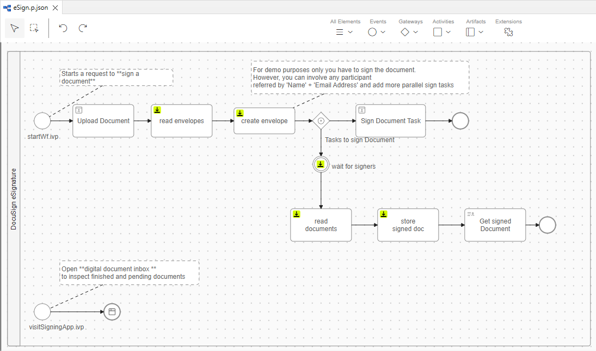

# DocuSign Connector
Axon Ivy's [DocuSign](https://www.docusign.com/products/electronic-signature)
connector helps you to accelerate process automation initiatives by integrating
eSignatures into your process application within no time. DocuSign eSignature
accelerates agreements, eliminates manual tasks, and makes it easy to connect
with the tools and systems you're already using. From sales contracts and
offer letters to account openings and invoices, DocuSign eSignature is the
world's #1 way to send and sign from practically anywhere, at any time. This
connector:

-	Is based on REST webservice technologies.
-	Provides access to the core features of DocuSign eSignature to virtually sign all kind of documents.
-	Supports you with an easy-to-copy demo implementation to reduce your integration effort.
-	Enables low code citizen developers to enhance existing business processes with electronic signature features.


## Demo

1. Upload a document and assign **signers** for it.  


1. Signers will be involved by an e-mail into the web-based signing flow.  


## Setup

Before any signing interactions between the Axon Ivy Engine and the DocuSign
eSignature services can be run, they have to be introducted to each other. This
can be done as follows:

1. Create a free DocuSign developer account: https://account-d.docusign.com/#/username
1. Create a new `application` at https://admindemo.docusign.com/authenticate?goTo=apiIntegratorKey
   - note the **User ID**
   - the **API Account ID**  
   
1. Edit the created application
   - note the **Integration Key**
   - scroll to **Authentication** choose `Authorization Code Grant`, click `Add Secrect Key`
     and note the **Secret Key**
   - scroll to **Additional settings** and configure a `Redirect URI` to Axon Ivy.
     The redirect uri must point to the Axon Ivy authentication callback URI `.../oauth2/callback`. 
	 For the Axon Ivy Designer this is normally `http://localhost:8081/oauth2/callback`
   - Save the changed application settings.  
   

1. run `start.ivp` of the eSign demo process to test your setup. Your setup was correct,
   if you are being asked to authorize yourself with a docuSign account.  
   

### Variables

In order to use this product you must configure multiple variables.

Add the following block to your `config/variables.yaml` file of our 
main Business Project that will make use of this product. Afterwards
set the values that you collected before.
(Note, that in the Designer these variables can be defined
in any project so there is no need to unpack the demo project.)

```
Variables:
  docusign-connector:
    # Integration key from your applications settings in the DocuSign eSignature "Apps and Keys" page.
    integrationKey: ''
    
    # Secret key from your applications settings in the DocuSign eSignature "Apps and Keys" page.
    # [password]
    secretKey: ''
    
    # If set, use a specific account id, otherwise use the default account of the user. (Probably only makes sense for JWT Token grant.)
    accountId: ''

    # Scope of grant.
    scope: signature impersonation
    
    # Docusign base url for authentication.
    baseUri: https://account-d.docusign.com/oauth

    jwt:
      # If 'true' JWT token grant else user grant (default).
      use: false

      # User ID from your eSignature "Apps and Keys" page.
      userId: ''
    
      # Name of the key file from your applications settings in the DocuSign eSignature "Apps and Keys" page relative to the "configuration" directory.
      keyFile: 'docusign.pem'
```

### Optional: Allow System Authentication (JWT)

The Demo process contains a final service part, where the Axon Ivy platform acts in the name of a user.  


This interaction requires a JSON Web Token (JWT) authentication setup:

1. Edit the docuSign `application` as in step 3. of the general setup.
1. In the section `Authentication` click on `Generate RSA` in order to create a secure key-pair.  
 

1. Store the generated private key:
	1. Copy the generated 'Private Key' to your clipboard
	1. Save the changed application settings
	1. Create a new empty text file called `docusign.pem` in your Designer 'configuration' directory
	1. Paste the contents of your clipboard into the `docusign.pem` file
	1. You can use another storage location for the pem file. Adjust the variable `docusign-connector.jwt.keyFile` to refer it. It should be a relative path to the 'configuration' directory or an absolute path on your system.  


1. Define a user to act as service account:
	1. Navigate to the `Users` overview and select your preferred service user
	2. Copy the `API Username (id)` stated on the user detail page
	3. Set it into the variable `docusign-connector.jwt.userId`
	
1. JWT will be used automatically for processes run by the system user. If you want to use it
   in general, set variable `docusign-connector.jwt.use` to `true`

1. Done. Start a signing process. Once all recipients have signed a document, the system service interaction will attach the signed document to the origin Case.
