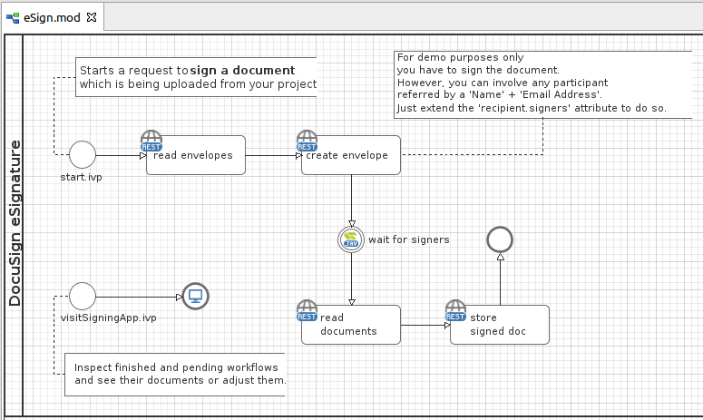
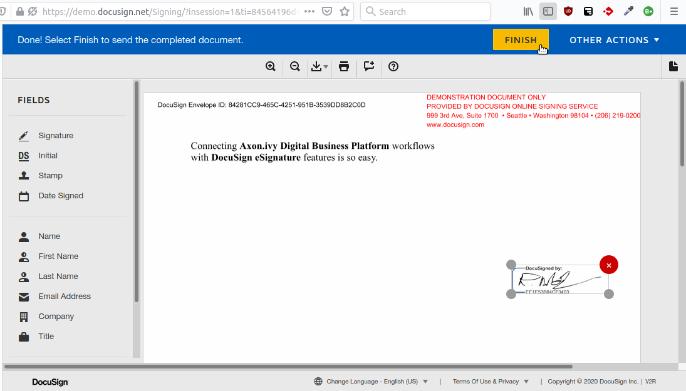
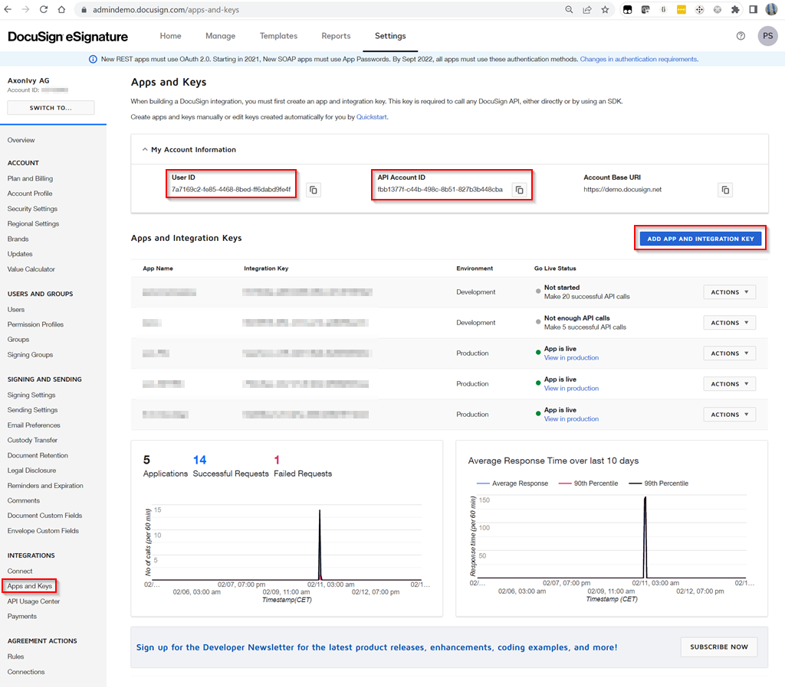
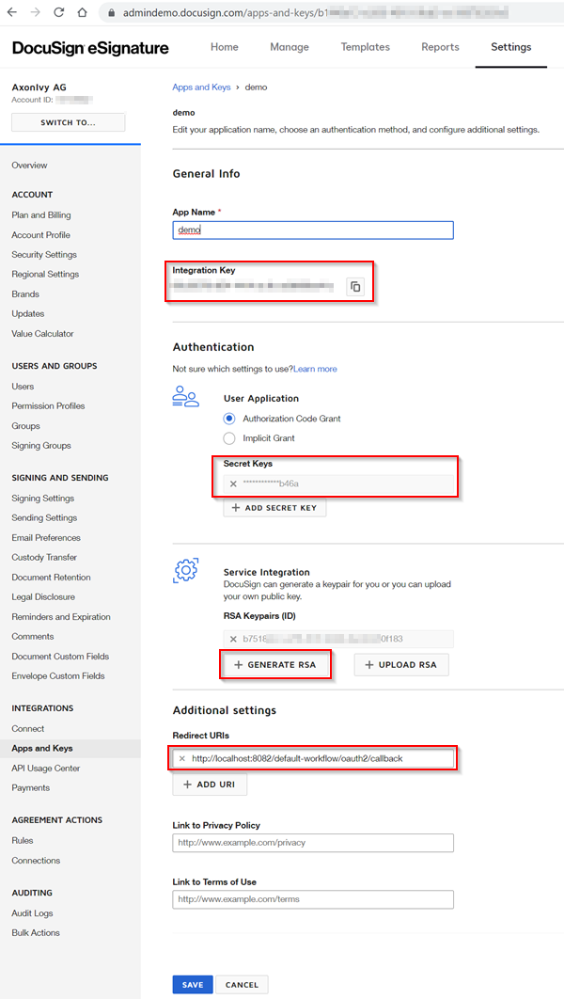
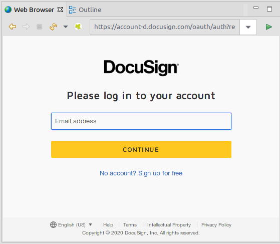
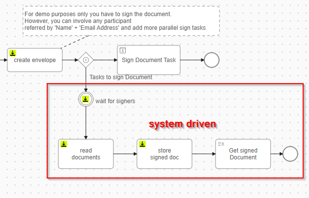
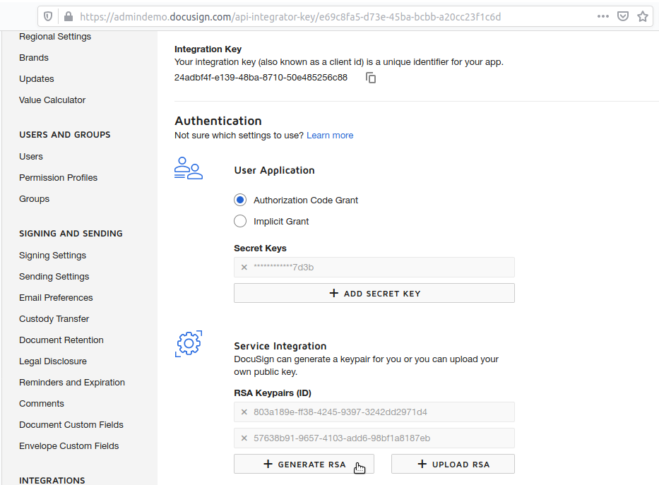
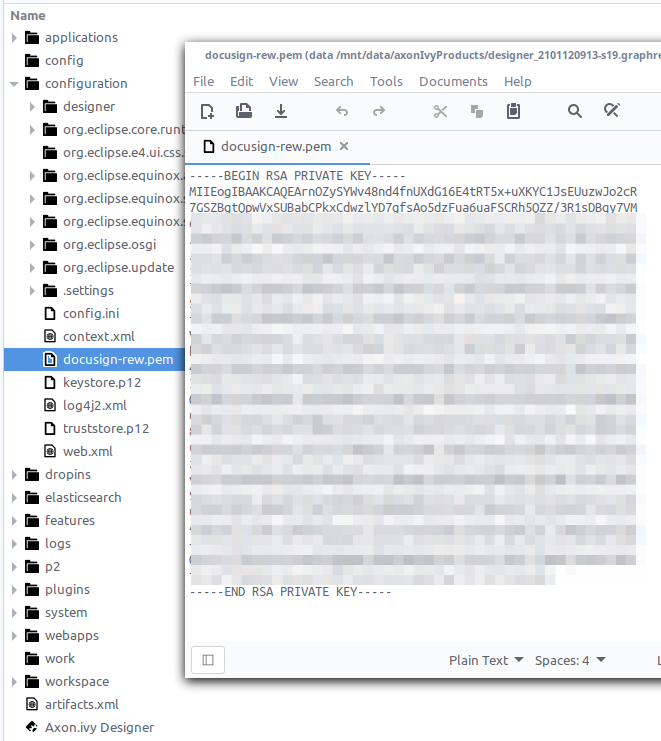

# DocuSign Connector
Der [DocuSign](https://www.docusign.com/products/electronic-signature) Connector von Axon Ivy bindet elektronische Signaturen in deine Prozessanwendung ein. DocuSign eSignature ermöglicht das schnelle und einfache Signieren von Dokumenten und lässt sich nahtlos in bestehende Systeme integrieren.

### Wichtigste Funktionen
- Ermöglicht Low-Code-Entwicklern die Integration von DocuSign eSignature in Axon Ivy-Prozesse.
- Bietet einfache Service-Aufrufe zum Erstellen von Umschlägen, Öffnen von Signaturansichten und Abrufen signierter Dokumente.
- Enthält eine einbettbare UI-Komponente `DocuSignPopup` für das integrierte Signieren innerhalb der App (iframe oder DocuSign JS).
- Unterstützt sowohl eingebettete als auch remote Signing-Workflows (Demo enthält schrittweise Beispiele).
- Liefert eine OpenAPI-Spezifikation und einen vorkonfigurierten REST-Client für einfache Integration und Tests.
- Bietet optionale Systemauthentifizierung (JWT) für serverseitige Szenarien mit Service-Accounts.


## Demo

1. Lade ein Dokument hoch und weise ihm **Unterzeichner** zu.  


1. Unterzeichner werden per E-Mail in den webbasierten Signiervorgang eingebunden.  


### Eingebettetes und Remote-Signing

Die Demo enthält zwei Signing-Szenarien:

1. Eingebettetes Signing — öffnet die Signatur-Oberfläche innerhalb deiner Anwendung über eine Empfängeransicht.
2. Remote-Signing — lädt Empfänger per E-Mail ein; Unterzeichner schließen den Vorgang auf der DocuSign-Seite ab.

Nutze die Demo-Einstiegspunkte `Embedded and Remote signing`, um beide Abläufe auszuprobieren und zu sehen, wie signierte Dokumente an Cases angehängt werden.

## Einrichtung

Bevor Signaturinteraktionen zwischen der Axon Ivy Engine und den DocuSign eSignature-Services möglich sind, müssen beide Seiten miteinander bekannt gemacht werden. So gehst du vor:

1. Erstelle ein kostenloses DocuSign-Entwicklerkonto: https://account-d.docusign.com/#/username
2. Erstelle eine neue `Anwendung` unter https://admindemo.docusign.com/authenticate?goTo=apiIntegratorKey
   - Notiere die **Benutzer-ID**.
   - Notiere die **API-Account-ID**.
   
3. Bearbeite die erstellte Anwendung:
   - Notiere den **Integration Key**
   - Scrolle zu **Authentication**, wähle `Authorization Code Grant`, klicke auf `Add Secret Key`
     und notiere den **Secret Key**
   - Scrolle zu **Additional settings** und konfiguriere eine `Redirect URI` für Axon Ivy.
     Die Redirect-URI muss auf den Axon Ivy-Authentifizierungs-Callback `.../oauth2/callback` zeigen.
	 Für den Axon Ivy Designer lautet diese normalerweise `http://localhost:8081/oauth2/callback`.
   - Speichere die geänderten Anwendungseinstellungen.  
   

4. Starte `start.ivp` des DemoESign-Demoprozesses, um deine Einrichtung zu testen. Die Einrichtung war erfolgreich,
   wenn du aufgefordert wirst, dich mit einem DocuSign-Konto zu autorisieren.  
   
   
5. Consent-Endpunkt abrufen:

   Du kannst das Browserfenster eines Benutzers auf den GET-Endpunkt `/oauth/auth` weiterleiten, um eine Einwilligung einzuholen. Dies ist der erste Schritt in verschiedenen Authentifizierungsszenarien und hat je nach übergebenen Parametern unterschiedliche Funktionen.
    
   Wenn du ihn im Browser aufrufst, kannst du diesen Endpunkt nutzen, um:
    
    *    Einzel- oder Admin-Einwilligung in einem der Authentifizierungsszenarien einzuholen.
    *    Einen Autorisierungscode für den Authorization Code Grant zu erhalten.
    *    Direkt ein Zugriffstoken über den Implicit Grant zu erhalten.

   Syntax und Parameter für den Aufruf dieses Endpunkts im Browser:
   ```
   https://account-d.docusign.com/oauth/auth?
        response_type=CODE_OR_TOKEN
        &scope=YOUR_REQUESTED_SCOPES
        &client_id=YOUR_INTEGRATION_KEY
        &state=YOUR_CUSTOM_STATE
        &redirect_uri=YOUR_REDIRECT_URI
    ```
    Nach einem erfolgreichen Aufruf prüft der Authentifizierungsdienst, ob die Client-Anwendung gültig ist und Zugriff auf den angeforderten Scope hat. Falls ja, gibt er die angeforderten Daten als Abfrageparameter an die angegebene Redirect-URI zurück:

    *   Im Implicit Grant-Szenario werden Zugriffstoken und Metadaten zurückgegeben.
    *   Im Authorization Code Grant-Szenario werden der Authentifizierungscode und ggf. der State zurückgegeben.


### Variablen

Um dieses Produkt zu nutzen, musst du mehrere Variablen konfigurieren.

Füge den folgenden Block in die Datei `config/variables.yaml` deines Haupt-Business-Projekts ein,
das dieses Produkt verwenden soll. Trage danach die zuvor notierten Werte ein.
(Hinweis: Im Designer können diese Variablen in jedem Projekt definiert werden –
es ist nicht nötig, das Demoprojekt zu entpacken.)

```
Variables:
  docusignConnector:
    # Integration key from your applications settings in the DocuSign eSignature "Apps and Keys" page.
    integrationKey: ''
    
    # Secret key from your applications settings in the DocuSign eSignature "Apps and Keys" page.
    # [password]
    secretKey: ''
    
    # If set, use a specific account id, otherwise use the default account of the user. (Probably only makes sense for JWT Token grant.)
    accountId: ''

    # Scope of grant.
    scope: signature impersonation
    
    # Docusign base url for authentication.
    baseUri: https://account-d.docusign.com/oauth

    jwt:
      # If 'true' JWT token grant else user grant (default).
      use: false

      # User ID from your eSignature "Apps and Keys" page.
      userId: ''
    
      # Name of the key file from your applications settings in the DocuSign eSignature "Apps and Keys" page relative to the "configuration" directory.
      keyFile: 'docusign.pem'
    # This property provides a call back that after the signer completes or ends the signing ceremony, DocuSign redirects the user's browser back to your app via the returnUrl that you supplied in the request.
    returnPage: 'http://localhost:8081/'

    # This property is a string array which must include your site's URL along with https://apps-d.docusign.com/send/ - opens in new window if your app is in the demo environment or https://apps.docusign.com - opens in new window if it is in production. Your domain must have a valid SSL certificate (such as https://my.site.com) for embedding in production environments. You can use http://localhost for development and testing.
    frameAncestors: 'http://localhost:8081/, https://apps-d.docusign.com'
    
    # This property must include https://apps-d.docusign.com/send/ - opens in new window if your app is in the demo environment or https://apps.docusign.com - opens in new window if it is in production.
    messageOrigins: 'https://apps-d.docusign.com'

```

> [!NOTE]
> Der Variablenpfad `docusign-connector` wurde ab Version 13 in `docusignConnector` umbenannt.

### Optional: Systemauthentifizierung aktivieren (JWT)

Der Demoprozess enthält einen abschließenden Service-Teil, in dem die Axon Ivy-Plattform im Namen eines Benutzers agiert.  


Für diese Interaktion ist eine JWT-Authentifizierung (JSON Web Token) erforderlich:

1. Bearbeite die DocuSign-`Anwendung` wie in Schritt 3 der allgemeinen Einrichtung beschrieben.
2. Klicke im Abschnitt `Authentication` auf `Generate RSA`, um ein sicheres Schlüsselpaar zu erstellen.  
 

3. Speichere den generierten privaten Schlüssel:
	1. Kopiere den generierten 'Private Key' in die Zwischenablage.
	2. Speichere die geänderten Anwendungseinstellungen.
	3. Erstelle eine neue leere Textdatei namens `docusign.pem` im Verzeichnis `configuration` deines Designers.
	4. Füge den Inhalt deiner Zwischenablage in die Datei `docusign.pem` ein.
	5. Du kannst einen anderen Speicherort für die PEM-Datei verwenden. Passe die Variable `docusignConnector.jwt.keyFile` entsprechend an. Es sollte ein relativer Pfad zum Verzeichnis `configuration` oder ein absoluter Pfad auf deinem System sein.  


4. Definiere einen Benutzer als Service-Account:
	1. Navigiere zur `Benutzer`-Übersicht und wähle deinen bevorzugten Service-Benutzer aus.
	2. Kopiere den `API Username (id)` von der Benutzerdetailseite.
	3. Trage ihn in die Variable `docusignConnector.jwt.userId` ein.
	
5. JWT wird automatisch für Prozesse verwendet, die vom Systembenutzer ausgeführt werden. Wenn du es generell nutzen möchtest,
   setze die Variable `docusignConnector.jwt.use` auf `true`.

6. Fertig. Starte einen Signierprozess. Sobald alle Empfänger ein Dokument unterzeichnet haben, hängt die System-Service-Interaktion das signierte Dokument automatisch an den ursprünglichen Case an.

## Komponenten

### Verfügbare CALLABLE_SUB-Prozesse


#### docusign-connector/processes/Processes/Envelopes.p.json

- Signatur: createEnvelope
  Eingabe: envelopeDefinition: com.docusign.esign.model.EnvelopeDefinition
  Ergebnis: envelopeId: String, error: ch.ivyteam.ivy.bpm.error.BpmError

- Signatur: createRecipientView
  Eingabe: envelopeId: String, signer: com.docusign.esign.model.Signer, returnPage: String
  Ergebnis: signingUrl: String, error: ch.ivyteam.ivy.bpm.error.BpmError

- Signatur: readDocuments
  Eingabe: envelopeId: String
  Ergebnis: documents: java.util.List<com.docusign.esign.model.EnvelopeDocument>, error: ch.ivyteam.ivy.bpm.error.BpmError

- Signatur: getSignedDocContentStream
  Eingabe: envelopeId: String, signedDocumentId: String
  Ergebnis: signedDocumentEntity: Object, error: ch.ivyteam.ivy.bpm.error.BpmError


### Formularkomponenten

#### DocuSignPopupData

- **Name Space**: com.axonivy.connector.docusign.connector.components.DocuSignPopup
- **Pfade:**
  - xhtml: docusign-connector/src_hd/com/axonivy/connector/docusign/connector/components/DocuSignPopup/DocuSignPopup.xhtml
- **Komponententyp**: HTML_DIALOG
- **Parameter**:
  - integrationKey (String)
  - event (String)
  - ivyToken (String)

### Open API-Ressourcen


### Maven artifacts

1. docusign-connector
```xml
<dependency>
  <groupId>com.axonivy.connector.docusign</groupId>
  <artifactId>docusign-connector</artifactId>
  <type>iar</type>
</dependency>
```

2. docusign-connector-demo
```xml
<dependency>
  <groupId>com.axonivy.connector.docusign</groupId>
  <artifactId>docusign-connector-demo</artifactId>
  <type>iar</type>
</dependency>
```