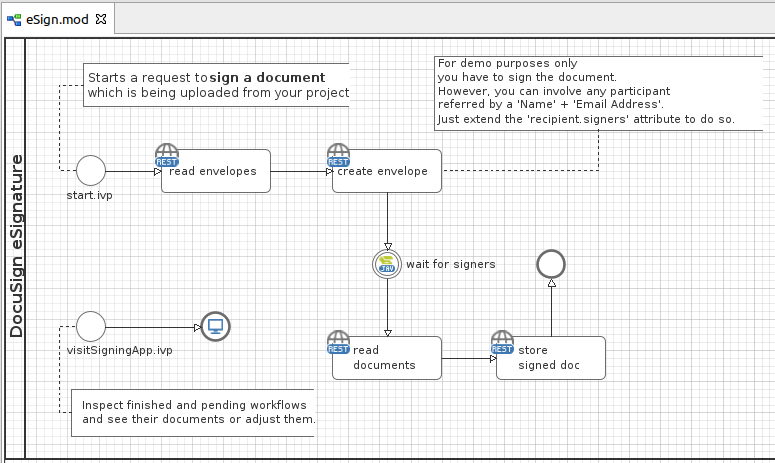

# DocuSign Connector

Der DocuSign Connector integriert Axon Ivy-Prozesse mit DocuSign, sodass du Signaturanfragen versenden, Signierabläufe in deine UI einbetten und signierte Dokumente automatisch abrufen kannst. Er automatisiert das Erstellen von Umschlägen, das Erzeugen von Empfängeransichten und das Abrufen von Dokumenten direkt aus deinen Axon Ivy-Anwendungen.

**Wichtigste Funktionen**

- Umschläge senden und Signaturen direkt aus deinen Axon Ivy-Prozessen verwalten, um manuellen Aufwand zu reduzieren.
- DocuSign-Signierabläufe in deine Anwendung einbetten für nahtlose In-App-Signiererlebnisse.
- Programmgesteuerte Erstellung von Empfänger-Signieransichten zur Unterstützung benutzerdefinierter Rückkehrseiten und eingebettetem Signieren.
- Signierte Dokumente automatisch abrufen und speichern für weiterführende Verarbeitung und Archivierung.
- Unterstützung konfigurierbarer Authentifizierung (Integration Key und optional JWT) über Projektvariablen.
- Beinhaltet Demo-Abläufe, die eingebettetes vs. entferntes Signieren sowie ein digitales Dokumenten-Postfach demonstrieren.

## Demo

Sieh dir die Demo-Implementierungen im Demo-Modul an; sie zeigen eingebettetes und entferntes Signieren, das Dokumenten-Postfach und Beispielintegrationen.



### Demo-Abläufe

#### docusign-connector-demo (docusign-connector-demo)

##### Initiere einen digitalen Dokument-Signatur-Workflow
1. Starte die Demo "Initiate a digital document signing workflow" aus dem Menü.
2. Lade ein Dokument über den Upload-Dialog hoch.
3. Konfiguriere Unterzeichner und Empfängerdetails, und starte die Signieranfrage.
4. Verfolge den Signaturfortschritt und lade die fertigen Dokumente herunter.

##### Übersicht: digitales Dokumenten-Postfach
1. Öffne die Demo für das digitale Dokumenten-Postfach.
2. Prüfe abgeschlossene und ausstehende Dokumente in der Übersicht.
3. Öffne ein signiertes Dokument zur Vorschau oder lade es herunter.
4. Nutze Filter oder Suche, um Dokumente zu finden.

##### Demo für eingebettetes und entferntes Signieren
1. Starte die Demo für Embedded and Remote Signing.
2. Wähle eingebettetes Signieren (in der App) oder entferntes Signieren (E-Mail-Link) und folge den Anweisungen.
3. Schließe den Signiervorgang ab und kehre zur Anwendung zurück.
4. Lade die signierten Dokumente herunter oder speichere sie entsprechend.

## Einrichtung

- **Rollen:** Everybody (konfiguriert in config/roles.xml)
- **OpenAPI:** https://github.com/docusign/eSign-OpenAPI-Specification/raw/master/esignature.rest.swagger-v2.1.json (Namespace: com.docusign.esign.model)

### Variablen

```
@variables.yaml@
```

 - Es wurden keine Installationsschritte im Repository gefunden. Folge der Moduldokumentation für installationsspezifische Anweisungen.

## Komponenten

### Aufrufbare Unterprozesse

#### Envelopes.p.json

- **Signatur**: createEnvelope(com.docusign.esign.model.EnvelopeDefinition envelopeDefinition) -> envelopeId: String
    - Eingaben:
        - `envelopeDefinition` (com.docusign.esign.model.EnvelopeDefinition)
    - Ergebnis:
        - `envelopeId` (String)
        - `error` (ch.ivyteam.ivy.bpm.error.BpmError)

- **Signatur**: createRecipientView(String envelopeId, com.docusign.esign.model.Signer signer, String returnPage) -> signingUrl: String
    - Eingaben:
        - `envelopeId` (String)
        - `signer` (com.docusign.esign.model.Signer)
        - `returnPage` (String)
    - Ergebnis:
        - `signingUrl` (String)
        - `error` (ch.ivyteam.ivy.bpm.error.BpmError)

- **Signatur**: readDocuments(String envelopeId) -> documents: java.util.List<com.docusign.esign.model.EnvelopeDocument>
    - Eingaben:
        - `envelopeId` (String)
    - Ergebnis:
        - `documents` (java.util.List<com.docusign.esign.model.EnvelopeDocument>)
        - `error` (ch.ivyteam.ivy.bpm.error.BpmError)

- **Signatur**: getSignedDocContentStream(String envelopeId, String signedDocumentId) -> signedDocumentEntity: Object
    - Eingaben:
        - `envelopeId` (String)
        - `signedDocumentId` (String)
    - Ergebnis:
        - `signedDocumentEntity` (Object)
        - `error` (ch.ivyteam.ivy.bpm.error.BpmError)

### Dialogkomponenten

#### DocuSignPopup — Eingebettete Signatur- & Popup-Komponente
- **Namespace:** com.axonivy.connector.docusign.connector.components.DocuSignPopup
- **Komponententyp:** Component dialog
- **Felder:** (keine)
- **UI-Attribute:**
   - `useIFrame` — Zum Einbetten deiner URL in ein natives iframe oder zur Nutzung des DocuSign-JS-Plugins
   - `signingURL` — Die Empfänger-View-URL, die von accounts/{accountId}/envelopes/{envelopeId}/views/recipient zurückgegeben wird
   - `documentName` — Wird im Kopfbereich des Signier-Popups angezeigt
   - `callbackActionOnSigningComplete` — Ein clientseitiger Callback, der nach erfolgreichem Abschluss des Signiervorgangs ausgeführt wird
- **Zweck:** Bietet einen einbettbaren Signaturdialog, mit dem du die DocuSign-Oberfläche innerhalb deiner Anwendung verwendest.

### Web-Services

- https://github.com/docusign/eSign-OpenAPI-Specification/raw/master/esignature.rest.swagger-v2.1.json

### Maven-Artefakte

1. docusign-connector

```xml
<dependency>
  <groupId>com.axonivy.connector.docusign</groupId>
  <artifactId>docusign-connector</artifactId>
  <type>iar</type>
</dependency>
```

2. docusign-connector-demo

```xml
<dependency>
  <groupId>com.axonivy.connector.docusign</groupId>
  <artifactId>docusign-connector-demo</artifactId>
  <type>iar</type>
</dependency>
```

