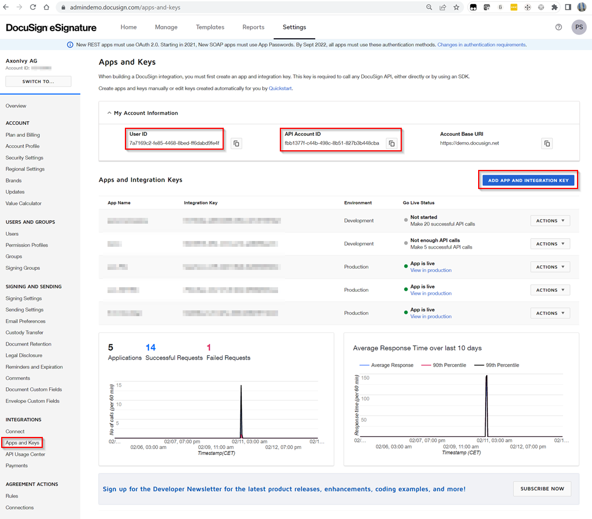
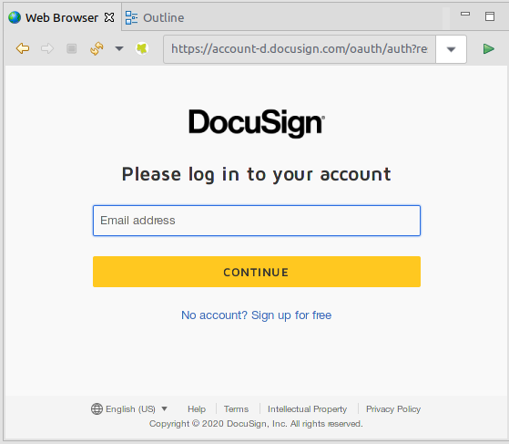
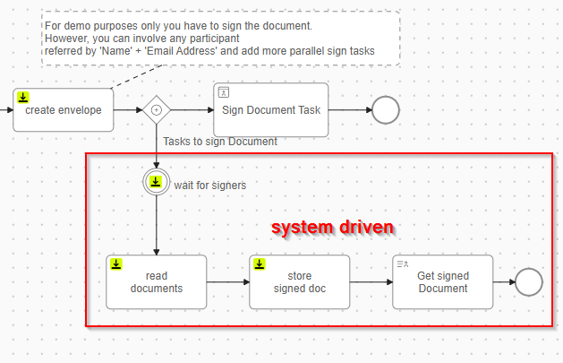

# DocuSign-Konnektor
Der [DocuSign](https://www.docusign.com/products/electronic-signature)-Konnektor
von Axon Ivy integriert elektronische Signaturen in Ihre Prozessanwendung.
DocuSign eSignature ermöglicht das schnelle und einfache Unterzeichnen von
Dokumenten und die Integration in bestehende Systeme.

Dieser Konnektor:

- ermöglicht Low-Code-Entwicklern die Integration elektronischer Signaturen in
  Axon Ivy-Prozesse.
- basiert auf REST-Webdiensttechnologien.
- Bietet Zugriff auf die wesentlichen Funktionen von DocuSign eSignature.

## Demo

1. Laden Sie ein Dokument hoch und weisen Sie ihm **signers** zu.\
   

1. Die Unterzeichner werden per E-Mail in den webbasierten
   Unterzeichnungsprozess einbezogen.\
   

## Setup

Bevor Signaturvorgänge zwischen der Axon Ivy Engine und den DocuSign
eSignature-Diensten ausgeführt werden können, müssen diese einander vorgestellt
werden. Dies kann wie folgt erfolgen:

1. Erstellen Sie ein kostenloses DocuSign-Entwicklerkonto:
   https://account-d.docusign.com/#/username
2. Erstellen Sie eine neue „ `“-Anwendung „` “ unter
   https://admindemo.docusign.com/authenticate?goTo=apiIntegratorKey.
   - Beachten Sie die Benutzer-ID „ **“**.
   - Die API-Kontonummer für „ **“ lautet**.
     
3. Bearbeiten Sie die erstellte Anwendung:
   - Beachten Sie den Integrationsschlüssel „ **“.**
   - Scrollen Sie zu „ **“ (Authentifizierungsanbieter auswählen)**, wählen Sie
     „ `“ (Autorisierungscode gewähren)`, klicken Sie auf „ `“ (Geheimen
     Schlüssel hinzufügen)` und notieren Sie sich den geheimen Schlüssel **.**
   - Scrollen Sie zu „ **“ (Zusätzliche Einstellungen) „** “ (Zusätzliche
     Einstellungen) und konfigurieren Sie eine „ `“ (Zusätzliche Einstellungen)
     „Redirect URI“ (Weiterleitungs-URI) „` “ (Weiterleitungs-URI) zu Axon Ivy.
     Die Weiterleitungs-URI muss auf die Axon
     Ivy-Authentifizierungs-Callback-URI „ `.../oauth2/callback“ (
     .../oauth2/callback) „` “ ( ) verweisen. Für den Axon Ivy Designer ist dies
     normalerweise „ `“ ( ) „http://localhost:8081/oauth2/callback“
     (http://localhost:8081/oauth2/callback) „` “ ( ).
   - Speichern Sie die geänderten Anwendungseinstellungen.\
     

4. Führen Sie „ `start.ivp` ” des DemoESign-Demo-Prozesses aus, um Ihre
   Einrichtung zu testen. Ihre Einrichtung war korrekt, wenn Sie aufgefordert
   werden, sich mit einem DocuSign-Konto zu autorisieren.\
   

5. Einwilligungs-Endpunkt abrufen:

   Sie können das Browserfenster eines Benutzers zum Endpunkt GET `/oauth/auth`
   umleiten, um die Zustimmung einzuholen. Dies ist der erste Schritt in
   mehreren Authentifizierungsszenarien. Je nach den übergebenen Parametern hat
   er unterschiedliche Funktionen.

   Wenn Sie in einem Browser zu dieser Datei navigieren, können Sie diesen
   Endpunkt verwenden, um:

    *    Holen Sie in jedem Authentifizierungsszenario die Zustimmung der
         einzelnen Person oder des Administrators ein.
    *    Beziehen Sie einen Autorisierungscode für die
         Autorisierungscode-Gewährung.
    *    Beziehen Sie einen Zugriffstoken direkt über die implizite Gewährung.

   Die Syntax und die Parameter, die zum Aufrufen dieses Endpunkts in Ihrem
   Browser verwendet werden, sind unten aufgeführt:
   ```
   https://account-d.docusign.com/oauth/auth?
        response_type=CODE_OR_TOKEN
        &scope=YOUR_REQUESTED_SCOPES
        &client_id=YOUR_INTEGRATION_KEY
        &state=YOUR_CUSTOM_STATE
        &redirect_uri=YOUR_REDIRECT_URI
   ```
   Nach einem erfolgreichen Aufruf überprüft der Authentifizierungsdienst, ob
   die Client-Anwendung gültig ist und Zugriff auf den angeforderten Bereich
   hat. Ist dies der Fall, gibt er die angeforderten Daten als Abfrageparameter
   an die angegebene Umleitungs-URI zurück:

    *   Im Szenario „Implicit Grant” werden Zugriffstoken und Metadaten
        zurückgegeben.
    *   Im Szenario „Authorization Code Grant“ werden der Authentifizierungscode
        und gegebenenfalls der Status zurückgegeben.

### Variablen

Um dieses Produkt nutzen zu können, müssen Sie mehrere Variablen konfigurieren.

Fügen Sie den folgenden Block zu Ihrer Datei „ `config/variables.yaml` ” unseres
Hauptgeschäftsprojekts hinzu, das dieses Produkt verwenden wird. Legen Sie
anschließend die zuvor gesammelten Werte fest. (Beachten Sie, dass diese
Variablen im Designer in jedem Projekt definiert werden können, sodass das
Demo-Projekt nicht entpackt werden muss).

```
Variables:
  docusignConnector:
    # Integration key from your applications settings in the DocuSign eSignature "Apps and Keys" page.
    integrationKey: ''

    # Secret key from your applications settings in the DocuSign eSignature "Apps and Keys" page.
    # [password]
    secretKey: ''

    # If set, use a specific account id, otherwise use the default account of the user. (Probably only makes sense for JWT Token grant.)
    accountId: ''

    # Scope of grant.
    scope: signature impersonation

    # Docusign base url for authentication.
    baseUri: https://account-d.docusign.com/oauth

    jwt:
      # If 'true' JWT token grant else user grant (default).
      use: false

      # User ID from your eSignature "Apps and Keys" page.
      userId: ''

      # Name of the key file from your applications settings in the DocuSign eSignature "Apps and Keys" page relative to the "configuration" directory.
      keyFile: 'docusign.pem'
    # This property provides a call back that after the signer completes or ends the signing ceremony, DocuSign redirects the user's browser back to your app via the returnUrl that you supplied in the request.
    returnPage: 'http://localhost:8081/'

    # This property is a string array which must include your site’s URL along with https://apps-d.docusign.com/send/ - opens in new window if your app is in the demo environment or https://apps.docusign.com - opens in new window if it is in production. Your domain must have a valid SSL certificate (such as https://my.site.com) for embedding in production environments. You can use http://localhost for development and testing.
    frameAncestors: 'http://localhost:8081/, https://apps-d.docusign.com'

    # This property must include https://apps-d.docusign.com/send/ - opens in new window if your app is in the demo environment or https://apps.docusign.com - opens in new window if it is in production.
    messageOrigins: 'https://apps-d.docusign.com'

```

> [!HINWEIS] Der variable Pfad `docusign-connector` wird ab Version 13 in
> `docusignConnector` umbenannt.

### Optional: Systemauthentifizierung (JWT) zulassen

Der Demo-Prozess enthält einen abschließenden Service-Teil, in dem die Axon
Ivy-Plattform im Namen eines Benutzers agiert.\


Für diese Interaktion ist eine JSON-Web-Token-Authentifizierung (JWT)
erforderlich:

1. Bearbeiten Sie die DocuSign-Anwendung „ `“` wie in Schritt 3 der allgemeinen
   Einrichtung beschrieben.
2. Klicken Sie im Abschnitt „ `-Authentifizierung“` auf „ `“ „RSA-` generieren“,
   um ein sicheres Schlüsselpaar zu erstellen.\
   

3. Speichern Sie den generierten privaten Schlüssel:
    1. Kopieren Sie den generierten „privaten Schlüssel” in Ihre Zwischenablage.
    2. Speichern Sie die geänderten Anwendungseinstellungen.
    3. Erstellen Sie eine neue leere Textdatei mit dem Namen „ `“,
       „docusign.pem“ und „` “ in Ihrem Designer-Konfigurationsverzeichnis.
    4. Fügen Sie den Inhalt Ihrer Zwischenablage in die Datei „ `docusign.pem` ”
       ein.
    5. Sie können einen anderen Speicherort für die PEM-Datei verwenden. Passen
       Sie die Variable an: `docusignConnector.jwt.keyFile`, um darauf zu
       verweisen. Es sollte sich um einen relativen Pfad zum Verzeichnis
       „configuration” oder einen absoluten Pfad auf Ihrem System handeln.\
       

4. Definieren Sie einen Benutzer, der als Dienstkonto fungieren soll:
    1. Navigieren Sie zur Übersicht „ `-Benutzer` ” und wählen Sie Ihren
       bevorzugten Service-Benutzer aus.
    2. Kopieren Sie den API-Benutzernamen (ID) „ `“`, der auf der Seite mit den
       Benutzerdetails angegeben ist.
    3. Setzen Sie diese in die Variable „ `” und
       „docusignConnector.jwt.userId”`.

5. JWT wird automatisch für Prozesse verwendet, die vom Systembenutzer
   ausgeführt werden. Wenn Sie es allgemein verwenden möchten, setzen Sie die
   Variable `docusignConnector.jwt.use` auf `true`.

6. Fertig. Starten Sie einen Signaturprozess. Sobald alle Empfänger ein Dokument
   signiert haben, fügt der Systemdienst das signierte Dokument an den
   ursprünglichen Fall an.
