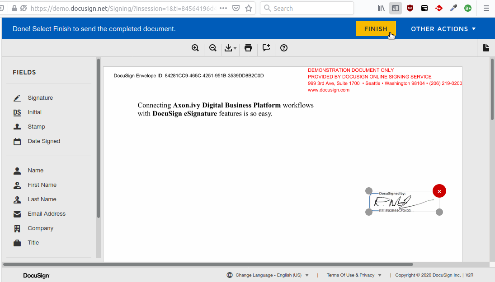
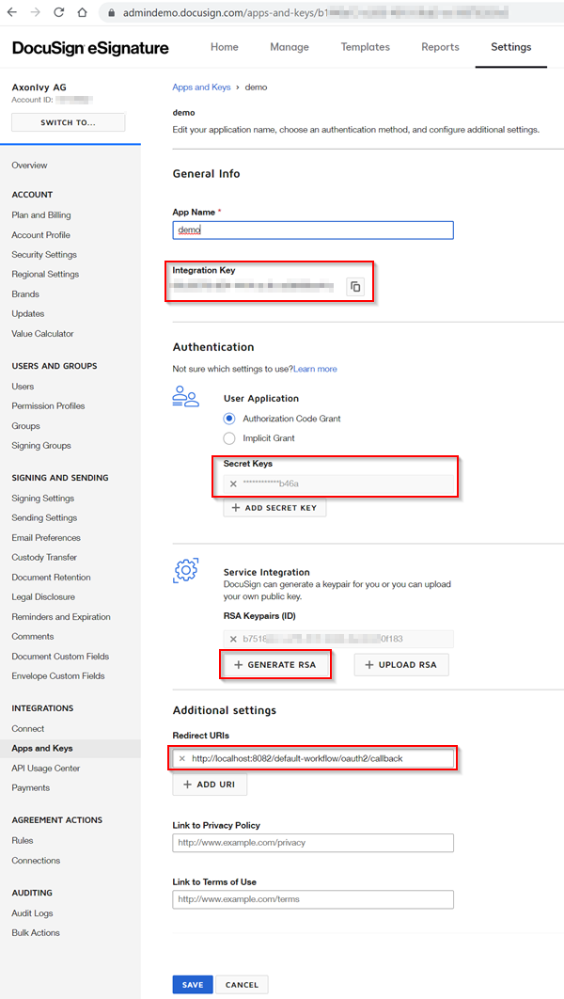
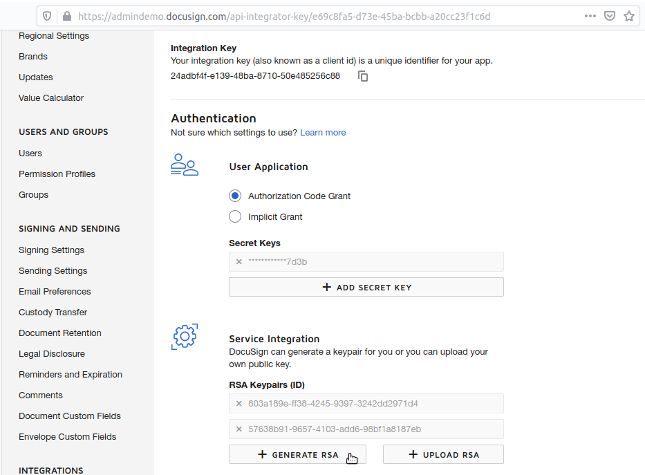
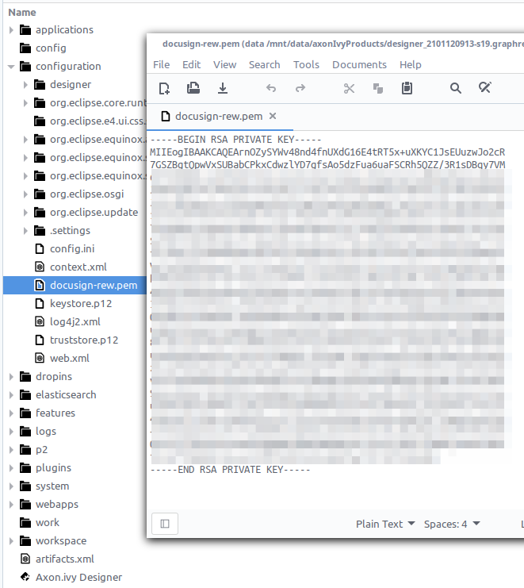

# DocuSign Anschluss
Das [DocuSign](https://www.docusign.com/products/electronic-signature) Anschluss
von #Axon #Ivy integriert elektronische Unterschriften hinein euren Arbeitsgang
Antrag. DocuSign eSignature Aktiviert flott und leicht signieren von Dokumente
und Integration hinein #existierend Systeme.

Dieser Anschluss:

- Aktiviert #blöken-Code Entwickler zu integrieren elektronische Unterschriften
  hinein #Axon #Ivy verarbeitet.
- Ist gegründet auf REST Web Bedienung Technologien.
- Versieht Zugang zu den essentiellen Aufgaben von DocuSign eSignature

## Demo

1. #Hochladen ein Dokument und zuweisen **#Unterfertigter** als ihm.\
   

1. #Unterfertigter wollen sein involviert #bei einer E-Mail hinein das
   Web-basisbezogene #Unterschrift Strömung.\
   

## Einrichtung

Vor irgendwelche #Unterschrift Interaktionen zwischen den #Axon Efeu Motor und
der DocuSign eSignature Bedienungen können sein gerannt, sie müssen sein
hereingebracht zu #jede #andere. Dies kann sein getan folgendermaßen:

1. Schaff ein frei DocuSign Entwickler Konto:
   Https://Konto-d.docusign.com/#/Benutzername
2. Schaff ein neues `Antrag` an
   https://admindemo.docusign.com/Beglaubigen?goTo=apiIntegratorKey
   - Beachte das **Nutzer ID**.
   - Das **API Verrechnen ID**. 
3. Bearbeite den geschaffenen Antrag:
   - Beachte das **Integration Schlüssel**
   - #Buchrolle zu **Authentifizierung** wählt aus `Berechtigung Code Grant`,
     Klick `Fügt zu Geheimen Schlüssel`, und beachten den **Geheimen Schlüssel**
   - #Buchrolle zu **Zuzügliche Lagen** und konfigurieren #ein `Leiten um URI`
     zu #Axon Efeu. Das umleiten URI müssen zeigen zu den #Axon Efeu
     Authentifizierung Rückruf URI `.../oauth2/Rückruf`. Für den #Axon Efeu
     Designer, dies ist in der Regel `http://localhost:8081/oauth2/Rückruf`.
   - Speicher den #abgeändert Antrag Lagen.\
     

4. Lauf `Start.ivp` Von das DemoESign Demo Arbeitsgang zu testen eure
   Einrichtung. Eure Einrichtung war richtig, ob du bist gefragt zu autorisieren
   #du mit eine DocuSign Konto.\
   

5. Bekomm Zusage Endpunkt:

   Du können ein NutzersBrowser Fenster umleiten zu das BEKOMMEN `/oauth/auth`
   Endpunkt zu bekommen Zusage. Dies ist das zuerst eintreten #mehrere
   Authentifizierung Szenarios. Es hat #wann verschiedene Aufgaben beliefert mit
   verschieden Parameter.

   Wann du befährst zu ihm in einem Browser, du kannst diesen Endpunkt benutzen
   zu:

    *    Bekomm individuell oder admin Zusage in #irgendein von die
         Authentifizierung Szenarios.
    *    Bekomm einen Berechtigung Code für den Berechtigung Code Grant.
    *    Bekomm direkt eine Zugang Automatenmünze, benutzend den Impliziten
         Grant.

   Die Syntax und Parameter benutzten für rufen diesen Endpunkt in eurem Browser
   ist gezeigt unten:
   ```
   https://account-d.docusign.com/oauth/auth?
        response_type=CODE_OR_TOKEN
        &scope=YOUR_REQUESTED_SCOPES
        &client_id=YOUR_INTEGRATION_KEY
        &state=YOUR_CUSTOM_STATE
        &redirect_uri=YOUR_REDIRECT_URI
   ```
   Nach einem erfolgreichen Anruf, die Authentifizierung Bedienung überprüft
   dass den Kunden Antrag ist gültig und hat Zugang zu dem #angefordert
   Anwendungsbereich. Ob also, es kehrt zurück #der #angefordert #Daten zu das
   #versehen umleiten URI da einen Anfrage Parameter:

    *   In dem Impliziten Grant Szenario, es kehrt zurück Zugang Automatenmünzen
        und #Metadaten.
    *   In den Berechtigung Code Grant Szenario, es kehrt zurück den
        Authentifizierung Code und konstatieren, ob #irgendein.

### Variablen

#Um zu benutzen dieses Produkt du musst mehrfache Variablen konfigurieren.

Füg zu den folgenden Block zu eure `config/Variablen.yaml` Datei von unserem
hauptsächlichen Geschäft Projekt will jener nützen von diesem Produkt. Danach
#setzen die Werte jener du sammeltest ein bevor. (Note, jener in dem Designer
diese Variablen können sein definiert so in irgendwelchem Projekt dort ist keine
Notwendigkeit zu auspacken das Demo Projekt).

```
Variables:
  docusignConnector:
    # Integration key from your applications settings in the DocuSign eSignature "Apps and Keys" page.
    integrationKey: ''

    # Secret key from your applications settings in the DocuSign eSignature "Apps and Keys" page.
    # [password]
    secretKey: ''

    # If set, use a specific account id, otherwise use the default account of the user. (Probably only makes sense for JWT Token grant.)
    accountId: ''

    # Scope of grant.
    scope: signature impersonation

    # Docusign base url for authentication.
    baseUri: https://account-d.docusign.com/oauth

    jwt:
      # If 'true' JWT token grant else user grant (default).
      use: false

      # User ID from your eSignature "Apps and Keys" page.
      userId: ''

      # Name of the key file from your applications settings in the DocuSign eSignature "Apps and Keys" page relative to the "configuration" directory.
      keyFile: 'docusign.pem'
    # This property provides a call back that after the signer completes or ends the signing ceremony, DocuSign redirects the user's browser back to your app via the returnUrl that you supplied in the request.
    returnPage: 'http://localhost:8081/'

    # This property is a string array which must include your site’s URL along with https://apps-d.docusign.com/send/ - opens in new window if your app is in the demo environment or https://apps.docusign.com - opens in new window if it is in production. Your domain must have a valid SSL certificate (such as https://my.site.com) for embedding in production environments. You can use http://localhost for development and testing.
    frameAncestors: 'http://localhost:8081/, https://apps-d.docusign.com'

    # This property must include https://apps-d.docusign.com/send/ - opens in new window if your app is in the demo environment or https://apps.docusign.com - opens in new window if it is in production.
    messageOrigins: 'https://apps-d.docusign.com'

```

> [!BEACHTE] Den variablen Pfad `docusign-Anschluss` ist #umbenennen zu
> `docusignConnector` von 13.

### Optional: Erlaub System Authentifizierung (JWT)

Der Demo Arbeitsgang zügelt eine endgültige Bedienung Teil, #wo der #Axon Efeu
Bahnsteig Darbietungen in dem Namen von einem Nutzer.\


Diese Interaktion bedürft eine JSON Web Automatenmünze (JWT) Authentifizierung
Einrichtung:

1. Bearbeite das DocuSign `Antrag` da #im gleichen Schritt und Tritt 3. Von der
   allgemeinen Einrichtung.
2. In der Sektion `Authentifizierung` klickt weiter `Generiert RSA` #um zu
   schaffen einen festen Schlüssel-paar.\
   

3. Lager das generiert persönlichen Schlüssel:
    1. Kopier das generiert 'Persönlichen Schlüssel' zu eurem Clipboard.
    2. Speicher den #abgeändert Antrag Lagen.
    3. Schaff einen neuen leeren Text Datei gerufen `docusign.pem` In eurem
       Designer 'Konfiguration' Telefonbuch.
    4. #Bekleben die Inhalte von eurem Clipboard hinein dem `docusign.pem`
       Datei.
    5. Du kannst anderen Speicher Drehort benutzen für den pem Datei. Pass an
       die Variable: `docusignConnector.jwt.keyFile` Zu übergeben zu ihm. Es
       sollte ein bezüglicher Pfad sein zu der 'Konfiguration' Telefonbuch oder
       ein völliger Pfad auf eurem System.\
       

4. Definier einen Nutzer zu handeln da ein Bedienung Konto:
    1. Befahr zu das `Nutzer` Überblick und auswählen eure #vorzugsberechtigt
       Bedienung Nutzer.
    2. Kopier das `API Benutzernamen (id)` konstatierte auf das Nutzer Detail
       Seite.
    3. Setz ihm hinein die Variable `docusignConnector.jwt.userId`.

5. JWT Wollen sein benutzt automatisch für Arbeitsgänge Lauf bei den System
   Nutzer. Ob du möchtest benutzen ihm #generell, Apparat Variable
   `docusignConnector.jwt.Nutzung` zu `wahr`.

6. Getan. Starte einen #Unterschrift Arbeitsgang. Einmal signiert haben alle
   Empfänger ein Dokument, die System Bedienung Interaktion wollen das #mit
   Vorzeichen versehen Dokument zu den Ursprung Fall anfügen.
